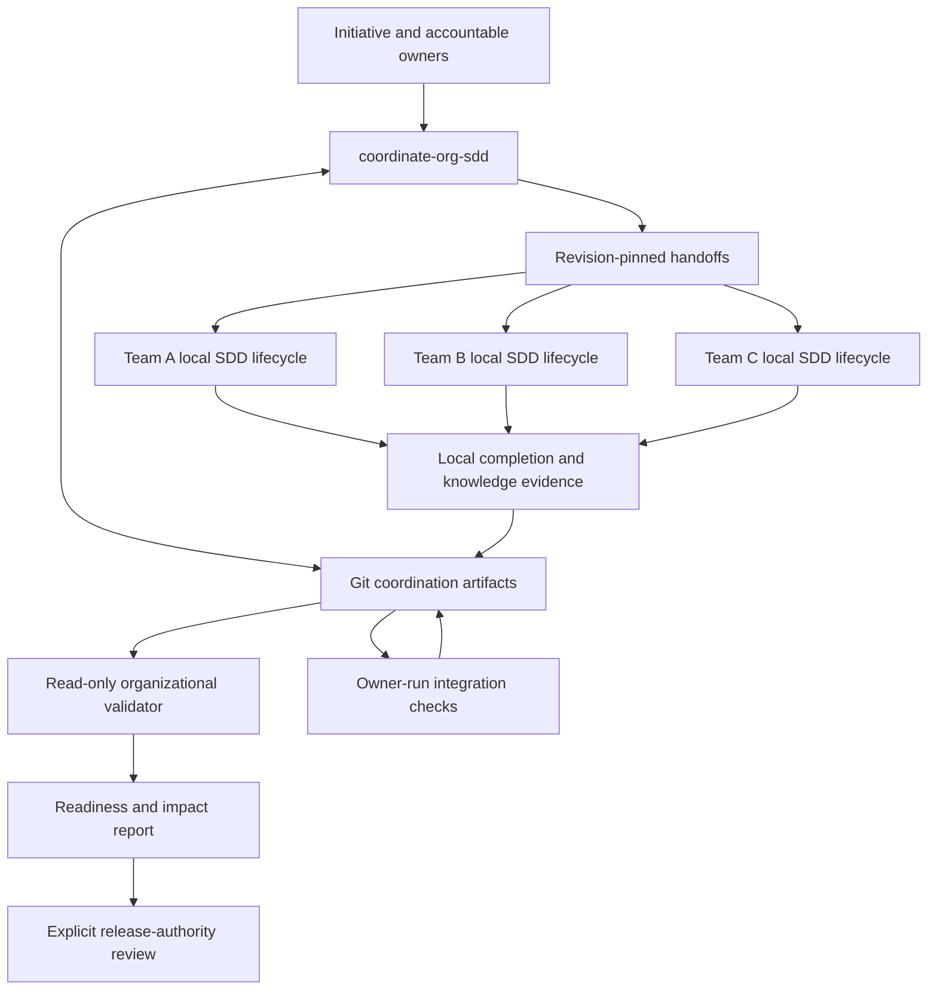

# Design Document: Organizational SDD Coordination

## Overview

Add an opt-in, file-based coordination layer to the existing four skills. A fifth skill, `coordinate-org-sdd`, curates cross-team agreements and computes readiness from versioned artifacts. It hands bounded work to each repository's existing lifecycle. It does not execute remote work, grant permissions, or substitute organizational summaries for local specifications.

This design covers all 27 approved requirements. The repository currently contains four standalone skill directories and Python validation scripts; there is no hosted runtime or shared library. The existing `next_wave.py` reports the first incomplete local wave, not cross-repository readiness. The extension therefore adds an organizational prerequisite check around local wave selection rather than reinterpreting its existing `ready` result as organizational readiness.

### Key Design Decisions

1. **Git files, not a service.** Coordination lives in an explicitly selected workspace under `initiatives/<initiative-id>/`. No database, queue, server, or automatic network access is needed. Git review provides history but does not authenticate approval records by itself.
2. **Explicit participation.** A participating checkout has `.sdd/org/context.json`; absence retains standalone behavior. An explicit handoff invocation can supply the same context for a session without creating a file. Invalid supplied context is an error, never a silent fallback.
3. **JSON control records and Markdown guidance.** Use strict JSON for machine-checked organizational records, Markdown for explanations, and references to existing API/event/schema documents. Python standard-library validation avoids another mandatory dependency. Normative contracts enumerate fields and invariants; no claim of general JSON Schema support is made.
4. **Evidence-derived readiness.** Authored status expresses intent or review state. Computed readiness is a report, not another authoritative workflow file. Local completion, integration verification, and release approval are distinct predicates.
5. **Revision-bound approval records.** Separate immutable approval records reference content digests. Updating a target makes the old record stale without rewriting its history. Actor identity and authority must be confirmed through the adopter's review process.
6. **Manual handoffs first.** The skill drafts a bounded handoff with prerequisites and expected evidence. Tool-based dispatch is an optional future integration, never assumed in V1.
7. **Installable skill owns its resources.** Put normative contracts, templates, and implementation under `coordinate-org-sdd/` so installation of that directory is self-contained. Existing skills discover the installed sibling skill by the skill catalog, not by assuming this source repository remains adjacent.

Tradeoffs: files keep deployment small and reviewable, but concurrent edits require ordinary Git conflict resolution; explicit records add bookkeeping but make stale approvals detectable. Hashes prove content identity, not truth. Cross-repository integration tests remain owned and run by the teams, not by the validator.

## Architecture



### Component Interaction Flow

1. Initialize by inspecting an explicit workspace and preserving existing files. Draft an initiative, participant records, owner assignments, policy inputs, and unresolved decisions from user-supplied facts. Do not invent sign-offs.
2. Validate structure. Obtain organizational scope and shared-contract approvals according to recorded adopter rules. Missing rules block the affected gate, not unrelated drafting.
3. Draft handoffs and stage-specific dependency edges. Resolve references against explicitly supplied local checkouts or authorized evidence snapshots. Planning against approved contracts need not wait for provider implementation.
4. Each team invokes its unchanged local approval sequence, with relevant organization references loaded at each gate. Material local changes to shared obligations return to contract review.
5. Before a wave, intersect locally eligible tasks with satisfied organizational prerequisites. Preserve the local wave boundary; do not jump into a later wave. Record blocked tasks and continue independent tasks only within the authorized scope and ownership rules.
6. After local verification, refresh Graphify/OKF where already required, prepare organizational knowledge reconciliation, and export completion evidence. Local completion does not wait for a future integration result, avoiding a circular dependency.
7. Integration owners run approved checks outside the validator and attach revision-bound evidence. Release authority separately approves the exact integration evidence and release scope.
8. On resume or changed inputs, recompute readiness. Report stale approvals and transitive impact. Preserve historical records; never silently upgrade them to newer revisions.

## Components and Interfaces

### Package layout

```text
coordinate-org-sdd/
  SKILL.md
  agents/openai.yaml
  contracts/                 # normative formats, gates, trust boundaries
  templates/                 # unapproved starter artifacts
  references/                # operational guidance and troubleshooting
  scripts/validate_org.py     # CLI adapter
  src/org_sdd/               # parsing, reference, graph, readiness logic
tests/
  fixtures/org/              # valid, blocked, stale, malformed cases
  test_org_*.py
  test_individual_regression.py
examples/three-team/          # illustrative snapshots and local handoffs
docs/organizational-sdd-tutorial.md
docs/organizational-sdd-adoption.md
.sdd/reports/                 # generated verification outputs, not authority
```

Normative contracts live in the skill's `contracts/`, templates in its `templates/`, implementation in `src/` with a thin `scripts/` entry point, tests at repository `tests/`. Existing skill-owned validators remain where they are. No implementation files are created during this design stage.

### Organizational validator

Planned CLI:

```text
python <skill>/scripts/validate_org.py --initiative <directory> --mode structure
python <skill>/scripts/validate_org.py --initiative <directory> --mode readiness --format json
python <skill>/scripts/validate_org.py --initiative <directory> --mode readiness --handoff <id> --stage execution --repo-map <local-json>
```

`--mode` defaults to `structure`. `--format` is `text` or `json`, default `text`. A handoff selector limits the readiness decision, not parsing or reference-integrity checks. `--stage` selects `planning`, `execution`, `local_complete`, `integration`, or `release`; omitted means report all stages. Missing mandatory inputs never imply readiness.

Exit codes: 0 means structurally valid in structure mode, or the requested readiness scope is satisfied in readiness mode; 1 means malformed/invalid artifacts; 2 means valid structure but blocked readiness; 3 means CLI or I/O failure. Every output includes mode, structural validity, requested scope, computed states, and diagnostics so a structure-mode zero cannot masquerade as approval. Reports sort records by stable IDs and do not include volatile generation timestamps in deterministic comparisons.

The optional repo map maps registered repository IDs to explicitly authorized local checkout or snapshot roots. These machine-local paths are not committed into shared manifests. The validator never clones repositories, fetches URLs, invokes tests, executes artifact commands, or writes approval/task records. Reports go to stdout; deliberate report capture is a caller action.

### Existing skill changes

| Skill | Organizational entry point | Preserved behavior |
| --- | --- | --- |
| `run-sdd-lifecycle` | Resolve explicit participation; load the installed coordination skill; check affected prerequisites before routing | Earliest incomplete local gate, one wave by default, no duplicate status store |
| `analyze-brownfield-context` | Add ownership, boundary contracts, external references, and uncertainty to relevant local OKF concepts | Source verification, manifest diff before replacement, initial/material review gates |
| `spec-to-task-plan` | Add an organizational traceability section mapping obligations and digests to local requirements, design elements, and task IDs | Exact root filenames and separate explicit approvals |
| `execute-task-waves` | Filter local candidates through handoff readiness; capture verification revisions; reconcile knowledge and draft outgoing evidence | Root ownership of TASKS.md, local dependency waves, verification, optional Ponytail lite/full/off |

If participation is explicit but the coordination skill is unavailable, stop affected work with installation/manual handoff instructions. Do not weaken checks or fall back silently. Invoke the organizational validator as a separate command; existing standalone CLI signatures remain compatible. Planning checks precede local requirements approval; execution checks precede each affected wave. Local traceability mappings must identify all handoff obligations as implemented, explicitly not applicable with owner approval, or unresolved.

## Data Models

### Coordination workspace

```text
initiatives/<id>/
  initiative.json
  contracts/<id>.json
  handoffs/<id>.json
  approvals/<id>.json
  evidence/<id>.json
  knowledge/<id>.json
  snapshots/                 # optional authorized, digest-verified attachments
```

Every record has `format_version: "1.0"`, `kind`, `id`, `owner`, `status`, and `provenance` (source reference, observed time, review status). IDs are unique within an initiative across record kinds. References include the initiative ID and record ID; cross-initiative dependencies are not implicitly traversed in V1 and require an explicit imported handoff snapshot. Unknown kinds, versions, duplicate keys, duplicate IDs, and invalid enum values fail validation. Empty owner assignments may be represented only as explicit unresolved decisions, never as an effective accountable owner.

| Record | Required domain fields |
| --- | --- |
| Initiative | purpose, scope, participants with repository IDs and owners, integration owner, policy decisions and required approver roles by gate, required handoff/contract/check IDs, rollout and rollback owners |
| Contract | category (`api`, `event`, `data`, `nfr`), provider, consumers, definition references, display version, baseline digest for changes, acceptance check IDs, compatibility assessment, migration/resolution evidence |
| Handoff | supplying and receiving owners, repository ID, bounded scope, obligation references, local artifact references and trace mappings, stage dependencies, acceptance check IDs, completion evidence references |
| Approval | actor supplied by human, role, gate/scope, decision (`approved`, `rejected`, `revoked`), timestamp, target ID and digest, policy digest, optional superseded record ID |
| Evidence | check ID and owner, outcome (`passed`, `failed`, `not_run`), procedure/command as inert text, tested source and contract refs, evidence attachment refs, timestamp, review state, illustrative flag |
| Knowledge | source refs/fingerprints, shared obligation refs, affected participants, freshness (`current`, `stale`, `conflicted`, `unresolved`), review status, local OKF concept refs, publication disposition |

Required fields and allowed conditional omissions are enumerated in normative format contracts during implementation. A valid draft may contain explicit unresolved decisions; readiness cannot resolve them by inference. Timestamps use timezone-qualified ISO 8601. Owner/actor values are identifiers, not credentials or authentication claims.

### References and digests

A source reference contains repository ID, repository-relative path, full immutable Git commit when available, and SHA-256 content digest. A local uncommitted snapshot uses `revision: null` plus the required digest and explicit snapshot provenance; it is not described as a committed revision. Moving branch names are descriptive only, never identity.

Control-record digests use UTF-8 canonical JSON with recursively sorted keys, compact separators, and no NaN/Infinity; the digest covers the entire target record. Human-document and attachment digests cover raw bytes. Approval records are separate from their targets, eliminating self-referential hashes. A small digest CLI mode or documented helper will use the exact same implementation as validation. No arbitrary normalization of source documents is allowed.

Approvals cover the target plus its pinned dependency references. Dependency resolution recomputes transitive validity: if a referenced contract changes, keeping an old target digest does not make that target current. Policy changes invalidate approvals referencing the old policy digest. Multiple approvals for the same role/target are not ordered by timestamp to resolve contradictions: explicit supersession or owner resolution is required. A rejected or revoked effective decision blocks that gate.

Local resolution verifies content against the supplied digest and, where a commit is asserted, checks that the bytes come from that commit using a bounded Git argument-vector call with no shell evaluation. Paths must be relative, without traversal, and resolved within the explicitly mapped root; symlink escapes are rejected. Remote URLs are displayed as references only. Authorized snapshots can establish pinned historical evidence, but never establish that an inaccessible remote HEAD is current. Reports state the exact baseline evaluated.

### Local participation record

`.sdd/org/context.json` contains `format_version`, `initiative_id`, `repository_id`, coordination locator, pinned initiative digest, and handoff IDs. The locator is an inert Git URL plus relative initiative path, or an explicit local workspace reference supplied by the user. No automatic network resolution occurs. Local `.sdd/org/` records do not replace `.sdd/knowledge/` or create a second local task status store.

### Stage dependency model

Graph nodes are `(artifact-or-handoff ID, stage)`, not whole repositories. An edge records `consumer_stage`, `producer_id`, `required_stage`, pinned obligation references, and acceptance evidence IDs. Contract approval is a provider stage distinct from implementation completion. Handoff stages are planning, execution, and local completion; initiative stages are integration and release. Internal stage precedence is included in cycle detection.

Readiness evaluation uses topological traversal of the resolved stage graph. Contract approval requires current references and effective approvals from configured roles. Execution readiness additionally requires local approved specification references and satisfied incoming edges. Local completion requires the handoff's specified passing checks at the declared baseline and current required knowledge review. Integration requires all required local completions and current passing integration checks. Release requires integration plus explicit release-scope approval referencing its evidence and rollout/rollback responsibilities.

Contract compatibility is `unchanged`, `compatible`, `breaking`, or `unknown`. A changed contract requires assessment evidence. Breaking/unknown cases block affected consumers until owner-approved migration or resolution evidence matches the new baseline. No universal semver rule or API compatibility engine is implied.

The validator computes states; manually authored `status: complete` cannot satisfy a missing predicate. Independent nodes remain reportable when another component is blocked. For global structural corruption, no execution authorization is derived until corrected.

### Knowledge reconciliation and persistence

After a wave, retain the existing brownfield sequence: capture changed paths, refresh graph where required, reconcile OKF concepts, then write the new source manifest and validate. Export only authorized boundary metadata and references. Publication disposition is `not_required`, `pending`, or `published`, with an evidence reference for publication. A pending outgoing update can coexist with verified local implementation, but the affected organizational handoff cannot be declared current until its configured synchronization/review conditions are met.

Git supplies durable history. Writers use reviewable artifact edits and do not overwrite existing approval IDs. Concurrent conflicts require owner resolution and revalidation; V1 has no distributed locking or last-writer-wins resolver. Sensitive context stays in its owning repository; restricted evidence remains explicitly unresolved unless an authorized, sufficiently scoped attestation is accepted by adopter policy.

## Correctness Properties

| Property and quantified invariant | Requirement coverage | Verification |
| --- | --- | --- |
| P1: For every coordinated action, ownership and supplied authority are scoped; drafting never implies dispatch or deployment permission | ORG-CORE-001, ORG-CORE-002, ORG-CORE-005, ORG-CORE-006 | Missing-owner and missing-tool scenarios; skill review |
| P2: Every parsed record has a supported format, unique identity, and valid typed references | ORG-CORE-003, ORG-VAL-001 | Parser, duplicate, version, and reference tests |
| P3: Every effective approval matches its exact target, policy, and current referenced baseline; any material mismatch prevents gate satisfaction | ORG-CORE-004 | Digest mutation, policy change, revocation, conflict tests |
| P4: Every changed shared obligation identifies affected consumers and has matching compatibility or migration evidence before their affected gate passes | ORG-CON-001, ORG-CON-002 | Changed-contract and transitive-impact tests |
| P5: Every ready stage has satisfied incoming edges; a contract-approved stage cannot satisfy an implementation-complete edge; cycles never produce readiness | ORG-CON-003, ORG-CON-004 | Graph tests including stage-specific cycles |
| P6: For every initiative, release approval requires integration evidence, and integration requires its specified local evidence; the reverse implications never hold | ORG-CON-005, ORG-CON-006 | Missing/failed/mismatched evidence and transition tests |
| P7: Every explicitly participating local gate checks relevant organizational inputs while preserving its original local gate | ORG-SKL-001, ORG-SKL-003, ORG-SKL-004 | Routing, trace mapping, and wave intersection tests |
| P8: Every organizationally relevant knowledge claim retains provenance and freshness; inference or an unpublished update never becomes an approved current fact implicitly | ORG-SKL-002, ORG-SKL-005 | Stale/conflicted/review/pending-publication fixtures |
| P9: For every input, structural validity, readiness, and authenticated authority are distinct; offline validation cannot assert remote latest state | ORG-VAL-002, ORG-SEC-001 | CLI output and restricted-source tests |
| P10: For every standalone regression case, absent participation preserves prior skill behavior and validator interfaces | ORG-VAL-003, ORG-VAL-004, ORG-VAL-005 | Automated regressions and OS matrix |
| P11: Every tutorial step references shipped artifacts and states its expected gate; example evidence is illustrative and cannot satisfy production readiness | ORG-DOC-001, ORG-DOC-002, ORG-DOC-003 | Walkthrough, example-isolation, link and install checks |
| P12: For every untrusted artifact, parsing and reference resolution cannot execute its commands or read outside explicitly mapped roots | ORG-SEC-002 | Injection, path traversal, symlink and inert-command tests |

## Error Handling

Errors contain a stable code, artifact/path, field or edge, affected stage, explanation, and suggested corrective action. Text output is concise; JSON preserves all fields. Never include source file contents or secrets in diagnostics.

- `FORMAT_INVALID`, `VERSION_UNSUPPORTED`, `ID_DUPLICATE`: correct structure; do not compute actionable execution readiness from malformed data.
- `REFERENCE_UNRESOLVED`, `DIGEST_MISMATCH`, `PATH_UNSAFE`: supply authorized evidence or correct the pinned reference; never fetch or traverse automatically.
- `OWNER_UNRESOLVED`, `POLICY_UNRESOLVED`, `APPROVAL_STALE`, `APPROVAL_CONFLICT`: identify the accountable role and gate; retain separate unblocked work.
- `DEPENDENCY_CYCLE`, `PREREQUISITE_UNMET`, `COMPATIBILITY_UNRESOLVED`: report involved nodes and revisions; require an owner-reviewed correction, not automatic edge deletion.
- `EVIDENCE_MISSING`, `EVIDENCE_FAILED`, `KNOWLEDGE_STALE`, `PUBLICATION_PENDING`: point to the exact missing check/reconciliation; do not rewrite task state.
- I/O or interrupted operations: preserve artifacts, rerun read-only validation, and inspect partial edits before resuming. No automatic retries with broader access.

## Testing Strategy

### Unit and property-style tests

Use Python `unittest` and temporary directories; no mandatory test framework dependency. Cover strict parsing, field contracts, canonical digests, approval supersession, path containment, source identity, graph cycle detection, deterministic reporting, and readiness predicates. Generate bounded acyclic/cyclic graphs to test invariants without adding a property-testing dependency. Mutation tests change one approved input or evidence field and assert the dependent state becomes stale/blocked.

### Integration and regression tests

Exercise the CLI end to end with ready, draft, partially ready, conflicted, stale, and inaccessible-source fixtures. Confirm every documented exit code. Test that illustrative records cannot pass production readiness; fixture evaluation requires an explicit `--allow-illustrative` flag and always labels its output non-production.

Run existing specification, task-graph, wave, and brownfield validators against standalone fixtures. Organizational wave tests verify intersection within the current wave and confirm later waves remain ineligible. Skill-instruction checks catch missing mandatory gates but are not represented as proof of agent behavior; scripted walkthroughs review actual prompts, outputs, and stopping conditions.

### Three-team smoke tutorial

Use illustrative Catalog (API provider), Checkout (consumer), and Analytics (event consumer) teams. Snapshots show draft scope, approved contract, an execution dependency block, local completions, a breaking contract update, migration resolution, integration success, release review, and knowledge refresh. Each snapshot is self-contained and uses synthetic actors/evidence. Include separate negative fixtures for unchanged, compatible, breaking, and unknown compatibility. Human approvals in examples are never copied into adopter templates.

Document both POSIX and PowerShell invocation forms with explicit paths. Planned suite command from the package repository: `python -m unittest discover -s tests -v`. CI runs macOS, Linux, and Windows with the declared minimum Python version and a current supported version selected during implementation. Local-only execution must disclose unverified platforms. Graphify-dependent execution is a separately labeled optional smoke check; core fixture tests require neither Graphify nor credentials.

### Release verification

The integration owner records full-suite results, requirement/property coverage, tutorial results, link checks, and residual gaps under `.sdd/reports/`. Validate all five skill metadata files and install instructions, including existing-destination preservation. No test command, passing report, or design approval authorizes publication or installation into active skill directories.

## Adoption, Operations, and Future Seams

README distinguishes individual and organizational entry points and installs all five directories without overwriting existing destinations. Graphify/graphifyy remains brownfield-only; Ponytail remains optional with its existing choice/default behavior. The adoption guide starts with one initiative, explains adding owners/contracts incrementally, and details stale approval and knowledge recovery. Leaving coordination requires an owner-reviewed disposition of open obligations, then removal of the local participation pointer; local specs and history remain intact.

V1 targets human-reviewable initiative-sized files. Parsing and graph evaluation are linear in record/edge count apart from sorting for deterministic output and reading referenced bytes. Do not promise a throughput target absent workload measurements. Revisit indexing, signed attestations, CI adapters, remote dispatch, and cross-initiative graph traversal only if usage warrants them; those are not hidden V1 deliverables. No service availability or failover architecture is needed; backups and access control are those of the adopter's Git hosting and workspaces.

## Decisions and Remaining Open Questions

No unresolved product choice blocks task planning once this design is approved. Organization-specific approver roles, disclosure policy, rollout authority, and acceptance checks remain required adopter inputs at their respective gates. The exact Python minimum and CI versions will be selected and documented during implementation against the existing scripts, with compatibility tests.

This artifact was explicitly approved on 2026-09-07. Requirements and design approvals were recorded without changing normative scope or inventing an approver identity. Design approval permits creation of TASKS.md only; implementation still requires its separate approval.
