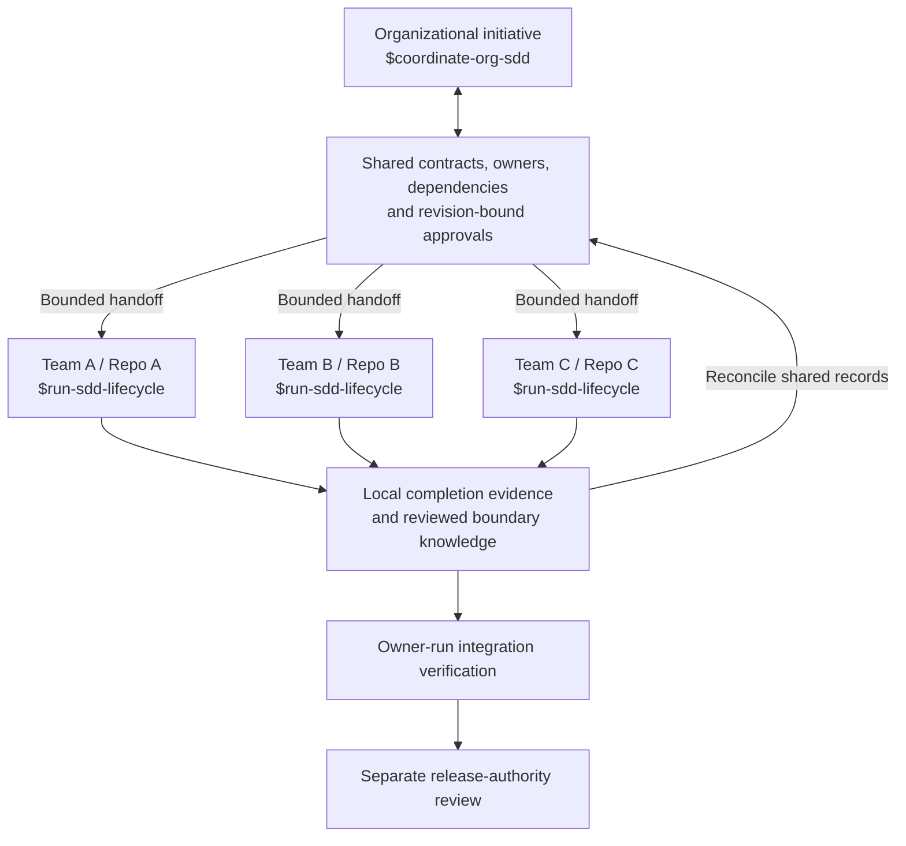
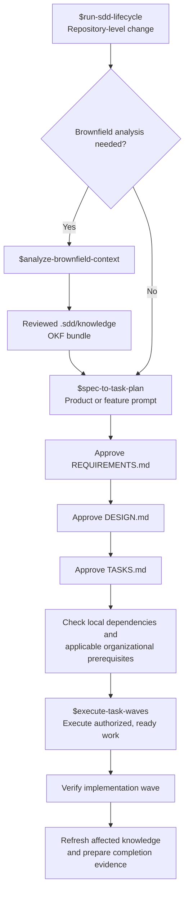

# Organizational SDD (OSDD)

### Spec-Driven Development (SDD) for Organizations


As AI continues to force us 

> Any organization that designs a system (defined broadly) will produce a design whose structure is a copy of the organization's communication structure.
>
> -- Melvin Conway

Two challenges scaled organizations face our brownfield repositories and heterogenous AI adoptions across teams. I've tried to create some Codex skills that address both by extending the notion of SDD to include a more native approach to managing context by maintaining a searchable knowledge graph (currently implemented with [graphify](https://github.com/Graphify-Labs/graphify)) and an organization governance layer which includes contracts, validation, tracabililty and evidence.

I am attempting to manage this governance at the repo layer and not require any service or agent layer.

## Organizational SDD Codex Skills

Federated Specification-Driven Development (SDD) for engineering organizations: coordinate cross-team initiatives through shared contracts, explicit ownership, revision-pinned handoffs, and integration evidence while each team retains control of its repository and delivery workflow.

This is the organizational agentic architecture layer **above the individual SDD harness**. It connects independently owned local workflows; it does not replace them with a central agent or require every team to share a checkout. The package provides five Codex skills, versioned artifact contracts, reusable templates, and deterministic local validators—not a hosted control plane or autonomous swarm service.

## Federation model



Federation means sharing obligations and evidence without transferring ownership:

- **Team autonomy:** local `REQUIREMENTS.md`, `DESIGN.md`, and `TASKS.md` remain authoritative for local work. Organizational readiness never bypasses a local approval gate.
- **Shared agreements:** API, event, data, and nonfunctional contracts identify providers, consumers, accountable owners, exact revisions, and acceptance checks.
- **Dependency-aware delivery:** an approved contract can enable planning before a provider finishes implementation. Execution checks the prerequisites for the affected work; independent work remains distinguishable from blocked work.
- **Evidence-aware change:** changed contracts or source revisions expose stale approvals and affected consumers. Local completion, integration verification, and release approval are separate states.
- **Federated knowledge:** reviewed boundary metadata and evidence references connect local knowledge bundles. Private source and detailed repository knowledge need not be copied into a central graph.

Coordination lives in a Git-based workspace under `initiatives/<initiative-id>/`. Teams opt in through `.sdd/org/context.json` or an explicit session handoff. The coordinator drafts and checks records; it does not automatically dispatch teams, modify other repositories, authenticate approvers, run integration tests, or release software. Cross-initiative graph traversal is not automatic in this version.

## Choose your entry point

| Your scope | Start with | Responsibility |
| --- | --- | --- |
| Cross-team or cross-repository initiative | `$coordinate-org-sdd` | Agree on boundaries, prepare handoffs, check dependencies, and reconcile integration evidence |
| A team's contribution to that initiative | `$run-sdd-lifecycle` with its organizational handoff | Deliver locally while preserving shared obligations and local gates |
| A standalone repository change | `$run-sdd-lifecycle` | Run the original local workflow without organizational setup |

### The five skills

- **`coordinate-org-sdd`** coordinates independently owned repositories through shared contracts, pinned handoffs and integration evidence. It drafts and checks records; it does not dispatch teams or authorize releases.
- **`run-sdd-lifecycle`** orchestrates the three local stage skills as one resumable workflow, consuming organizational context when supplied and preserving every approval and governance gate.

- **`analyze-brownfield-context`** maps an existing repository with Graphify and curates durable findings into an OKF v0.2 knowledge bundle.
- **`spec-to-task-plan`** turns a product or feature prompt into separately approved `REQUIREMENTS.md`, `DESIGN.md`, and `TASKS.md` artifacts.
- **`execute-task-waves`** executes an approved `TASKS.md` plan in dependency order, verifies each wave, and records completion evidence centrally.

## Quick start: see federation in action

Try the read-only [three-team tutorial](docs/organizational-sdd-tutorial.md) before installing anything. Catalog provides an API, Checkout consumes it, and Analytics consumes its derived event. Nine snapshots demonstrate shared-contract approval, blocked execution, a breaking change, migration, integration, release review, and knowledge refresh. From this checkout, with Python on PATH:

```sh
python3 examples/three-team/run_example.py --snapshot 02-approved-contract --coordinator-skill coordinate-org-sdd --allow-illustrative --format json
```

Expected: exit 0, three planning stages ready, `illustrative: true`. No implementation tests, approval, publication or release occur. PowerShell users can use `python` with the same arguments. The [adoption guide](docs/organizational-sdd-adoption.md) covers real ownership, policy inputs, revision changes and safe departure.

## Organizational workflow

1. **Define one initiative.** Identify participating repositories, accountable owners, scope, approval rules, and disclosure boundaries. Leave missing decisions explicitly unresolved.
2. **Agree on shared contracts.** Review obligations and acceptance checks, then bind approvals to their exact revisions.
3. **Prepare team handoffs.** Pin each contribution's scope, contract references, stage-specific dependencies, and expected evidence. Supply the handoff to the team's local lifecycle.
4. **Deliver within each repository.** Approve requirements, design, and tasks separately; execute eligible local waves and check organizational prerequisites before affected work begins.
5. **Verify integration and review release.** Collect revision-bound local evidence, obtain owner-run integration results, and request the separate release authority's approval. A passing validator is not human approval or a deployment.
6. **Keep the federation current.** Refresh affected local knowledge, prepare authorized boundary updates, and revalidate contracts, consumer handoffs, and approvals when their inputs change.

Start with one initiative and add participants incrementally. Use the [adoption and recovery guide](docs/organizational-sdd-adoption.md) for ownership changes, stale evidence, contract conflicts, and returning a repository to standalone operation.

### Local workflow inside each team



The planning skill never implements product code. The execution skill requires an explicitly approved task plan and stops at failed verification, missing authority, or human governance gates.

`run-sdd-lifecycle` is the repository-level entry point. It derives state from the repository artifacts rather than maintaining a separate workflow-status file. Without explicit organizational participation, this individual workflow stays unchanged.

## Optional: Ponytail

[Ponytail](https://github.com/DietrichGebert/ponytail) can be used as an optional implementation-minimization layer during `execute-task-waves`. The SDD artifacts define what must be built; Ponytail helps find the smallest implementation that satisfies those approved contracts.

Use Ponytail's repository for installation and platform instructions; it is not installed by the skill commands below.

When Ponytail is available or requested, `execute-task-waves` asks once before the first executable wave for `lite`, `full`, or `off`; `lite` is the recommended default. The selection is a workflow preference, not an approval gate. Ponytail is never required, and its recommendations cannot remove or weaken approved requirements, design, acceptance criteria, tests, evidence, security, privacy, accessibility, error handling, or governance controls.

## Install

### Brownfield dependency: Graphify

The `analyze-brownfield-context` skill requires the Graphify CLI. The Python package is named `graphifyy` (with two `y` characters), while the installed command is `graphify`:

```sh
uv tool install graphifyy
graphify --version
```

If `graphify` is not found after installation, run `uv tool update-shell`, open a new terminal, and retry `graphify --version`.

Graphify is required only for brownfield graph creation and refresh. The specification and task-execution validators remain usable without it when a repository has no Graphify graph or OKF brownfield bundle.

### Install the five Codex skills

Use an inspected checkout in a durable location and run the relevant block from its repository root. If you need a checkout, obtain one through your normal Git workflow from [org-sdd-codex-skills](https://github.com/mark081/org-sdd-codex-skills). Installation changes the selected Codex skills directory; the tutorial does not require installation.

Both blocks respect `CODEX_HOME`; otherwise they use your user profile's `.codex` directory. They preflight all five destinations and refuse existing files, directories, links, junctions and broken symlinks. Inspect and preserve any existing installation before choosing a replacement; do not add force-overwrite flags. Run installation without another process concurrently changing the same destinations.

#### macOS and Linux

The default is a symlink installation. For independent copies, set `SDD_INSTALL_MODE=copy` before running the same block.

<!-- install-posix -->
```sh
install_sdd_skills() (
    set -eu
    sdd_repo=$(pwd -P)
    sdd_skills="${CODEX_HOME:-$HOME/.codex}/skills"
    sdd_mode="${SDD_INSTALL_MODE:-link}"
    case "$sdd_mode" in link|copy) ;; *) echo "Use link or copy" >&2; exit 1 ;; esac
    for sdd_name in analyze-brownfield-context spec-to-task-plan execute-task-waves run-sdd-lifecycle coordinate-org-sdd; do
        test -f "$sdd_repo/$sdd_name/SKILL.md" || { echo "Missing skill: $sdd_name" >&2; exit 1; }
        sdd_destination="$sdd_skills/$sdd_name"
        if test -e "$sdd_destination" || test -L "$sdd_destination"; then
            echo "Destination already exists: $sdd_destination" >&2
            exit 1
        fi
    done
    mkdir -p "$sdd_skills"
    for sdd_name in analyze-brownfield-context spec-to-task-plan execute-task-waves run-sdd-lifecycle coordinate-org-sdd; do
        sdd_destination="$sdd_skills/$sdd_name"
        if test "$sdd_mode" = link; then
            ln -s "$sdd_repo/$sdd_name" "$sdd_destination"
        else
            mkdir "$sdd_destination"
            cp -R "$sdd_repo/$sdd_name/." "$sdd_destination/"
        fi
    done
)
install_sdd_skills
```

#### Windows PowerShell

The default copies directories. To use Windows directory junctions, change the last line to `Install-SddSkills -Mode Junction`. `SymbolicLink` is also available where your permissions allow it. Junctions are a Windows option; PowerShell on macOS/Linux can use Copy or SymbolicLink.

<!-- install-powershell -->
```powershell
function Install-SddSkills {
    param([ValidateSet('Copy', 'Junction', 'SymbolicLink')][string]$Mode = 'Copy')
    $ErrorActionPreference = 'Stop'
    $sddRepo = (Get-Location).Path
    $sddCodexRoot = if ($env:CODEX_HOME) { $env:CODEX_HOME } else {
        Join-Path ([Environment]::GetFolderPath('UserProfile')) '.codex'
    }
    $sddSkills = Join-Path $sddCodexRoot 'skills'
    $sddNames = @('analyze-brownfield-context', 'spec-to-task-plan', 'execute-task-waves', 'run-sdd-lifecycle', 'coordinate-org-sdd')
    $sddExisting = if (Test-Path -LiteralPath $sddSkills) {
        @(Get-ChildItem -LiteralPath $sddSkills -Force -Name)
    } else { @() }
    foreach ($sddName in $sddNames) {
        $sddSource = Join-Path $sddRepo $sddName
        if (-not (Test-Path -LiteralPath (Join-Path $sddSource 'SKILL.md') -PathType Leaf)) {
            throw "Missing skill: $sddName"
        }
        if ($sddExisting -contains $sddName) {
            throw "Destination already exists: $(Join-Path $sddSkills $sddName)"
        }
    }
    [System.IO.Directory]::CreateDirectory($sddSkills) | Out-Null
    foreach ($sddName in $sddNames) {
        $sddSource = Join-Path $sddRepo $sddName
        $sddDestination = Join-Path $sddSkills $sddName
        if ($Mode -eq 'Copy') {
            New-Item -ItemType Directory -Path $sddDestination | Out-Null
            Get-ChildItem -LiteralPath $sddSource -Force | Copy-Item -Destination $sddDestination -Recurse
        } else {
            New-Item -ItemType $Mode -Path $sddDestination -Target $sddSource | Out-Null
        }
    }
}
Install-SddSkills
```

Restart Codex after installation or updates so it reloads the skill catalog. Installed skills discover one another through that catalog; they do not require sibling checkout paths.

### Updates and recovery

Review an update in a separate checkout before advancing a source checkout that active symlinks/junctions target: changes to that target are immediately visible through the links. Keep the target at its durable location. Preserve local modifications and use your normal reviewed Git update process; do not force-reset it.

Copies stay at the installed version until deliberately replaced. For each of the five exact destinations, inspect whether it is a directory or link, record its source/version, and move it to a uniquely named backup outside the discovery directory before running the installer again. A broken link is still an existing destination. On Windows inspect the reparse point; moving a junction must move the junction itself, not its target. Never recursively delete a link target or the skills root to update these skills. If installation fails partway, inspect and preserve each created destination, then retry only after all five target names are clear. The preflight intentionally refuses to merge into a partial installation.

To roll back, preserve the failed version, restore the exact backed-up destinations or reviewed source revision, and restart Codex. Updating files does not migrate organizational artifact formats or approve changed specifications; follow the [adoption guide](docs/organizational-sdd-adoption.md).

## Use

### Start an organizational initiative

Open Codex in the coordination workspace and invoke:

```text
Use $coordinate-org-sdd to initialize an initiative in initiatives/<initiative-id>/
for this cross-team change: <outcome>.
Participating repositories and owners: <references and accountable owners>.
Draft the scope, shared contracts, dependencies, and bounded team handoffs.
Identify missing policy decisions and approvals; do not dispatch work.
```

Supply real owner and policy inputs; do not copy the tutorial's synthetic approvals. Review the generated records using the [artifact contracts](coordinate-org-sdd/contracts/records.md) and [unapproved templates](coordinate-org-sdd/templates/README.md).

### Deliver a participating team's contribution

In the team's checkout, supply its approved handoff and authorized coordination workspace reference:

```text
Use $run-sdd-lifecycle for initiative <initiative-id>, repository <repository-id>,
and handoff <handoff-id> in <coordination-workspace>.
Verify the pinned organizational inputs and begin at the earliest incomplete local gate.
```

For persistent participation, use the documented `.sdd/org/context.json` record. The coordinator does not create remote tasks or modify team repositories merely because a handoff exists.

### Resume organizational coordination

```text
Use $coordinate-org-sdd to inspect and reconcile initiatives/<initiative-id>/.
Report stage-specific readiness, blocked dependencies, stale approvals,
and missing integration or knowledge evidence at the supplied revisions.
Prepare the next owner handoffs without publishing or releasing anything.
```

### Use the standalone lifecycle or an individual stage

Open Codex in a project repository and invoke:

```text
Use $run-sdd-lifecycle to implement this change: <prompt>
```

The orchestrator detects whether brownfield analysis is warranted, resumes the earliest incomplete stage, and pauses for each required approval. You can also invoke an individual stage directly:

```text
Use $analyze-brownfield-context to map this existing repository and create or refresh its OKF knowledge bundle.
```

After reviewing the generated context, invoke:

```text
Use $spec-to-task-plan to turn this feature request into requirements, design, and executable tasks: <prompt>
```

Approve each artifact explicitly when it is ready. After approving `TASKS.md`, invoke:

```text
Use $execute-task-waves to execute the next dependency-ready wave.
```

The skills honor the nearest `AGENTS.md`. The planning workflow currently uses exact root-level filenames—`REQUIREMENTS.md`, `DESIGN.md`, and `TASKS.md`—so use one active SDD change per checkout or a separate Git worktree for each concurrent change.

## Requirements

- Codex with local skill support
- CPython 3.11–3.14 for the supported tooling range; Git on PATH for revision/fixture checks
- PyYAML 6.0.3 for the brownfield validator and full regression suite
- `uv` optionally for isolated dependencies, or an existing Python environment with pip
- Graphify (`graphify` CLI installed from the `graphifyy` package) for brownfield extraction and refresh
- A version-controlled project workspace

The organizational, specification and wave validators use the Python standard library and need neither Graphify nor credentials. The brownfield validator requires PyYAML. Core validation is local and does not require network access once dependencies are available.

### Runtime support and verification

The supported minimum is CPython 3.11; the current stable boundary selected for CI is 3.14. Python 3.11 remains in security support, while 3.14 is in bugfix support; review these boundaries as upstream support changes. [Python version status](https://devguide.python.org/versions/).

From a selected supported Python environment, install the declared test dependency when authorized, then run:

```text
python -m pip install -r requirements-test.txt
python -m unittest discover -s tests -v
```

Use `python3` in POSIX shells if that is your selected interpreter. With an already populated uv cache, the offline equivalent is:

```text
uv run --offline --with pyyaml==6.0.3 python -m unittest discover -s tests -v
```

A missing cache entry is a missing dependency, not permission to download software automatically. Coordination-only example commands require no third-party dependency. Graphify and Ponytail are not installed or invoked by the core suite.

The [CI workflow](.github/workflows/tests.yml) configures six jobs: macOS, Linux and Windows, each on Python 3.11 and 3.14. It uses explicit Python selection, read-only repository permissions and no persisted checkout credentials. The action versions were checked against the official [setup-python release](https://github.com/actions/setup-python/releases/tag/v7.0.0) and [checkout release](https://github.com/actions/checkout/releases/tag/v7.0.0).

Local verification was performed on macOS with Python 3.13.11/PyYAML 6.0.3 (full suite) and Python 3.14.7 (standard-library subset), plus PowerShell 7.7 preview. The full Python 3.14 run could not resolve PyYAML from the offline cache; Python 3.11 was not installed. Native Windows/Linux and the full hosted matrix have **not** run during implementation; a configured workflow is not a passing CI result. Tests report unavailable symlink/PowerShell capabilities and native-only shell cases as explicit skips. Windows junctions require native Windows verification. See `.sdd/reports/` for the final runtime results and gaps before publishing. This package does not claim support for older/EOL Python, prereleases or free-threaded variants; no compatibility-breaking edits were made to existing standalone CLI signatures.

## Repository contents

Skill entry points:

- [Organizational coordination](coordinate-org-sdd/SKILL.md)
- [Lifecycle](run-sdd-lifecycle/SKILL.md)
- [Brownfield analysis](analyze-brownfield-context/SKILL.md)
- [Specification planning](spec-to-task-plan/SKILL.md)
- [Wave execution](execute-task-waves/SKILL.md)

Skills package their own applicable resources:

- `SKILL.md` — workflow instructions and trigger description
- `agents/openai.yaml` — Codex display metadata and default prompt
- `references/` — artifact, approval, or execution contracts
- `scripts/` — deterministic validators or task-wave inspection tools

The coordinator also contains [normative contracts](coordinate-org-sdd/contracts/records.md), [unapproved templates](coordinate-org-sdd/templates/README.md), and `src/org_sdd/`. [Example snapshots](examples/three-team/README.md) are synthetic; [tests](tests/) exercise local tools. Generated verification reports belong in `.sdd/reports/` and carry no approval authority.

## License

Copyright 2026 Mark Cooper and SierraX Technologies.

Licensed under the [Apache License 2.0](LICENSE). See [NOTICE](NOTICE) for attribution information.
