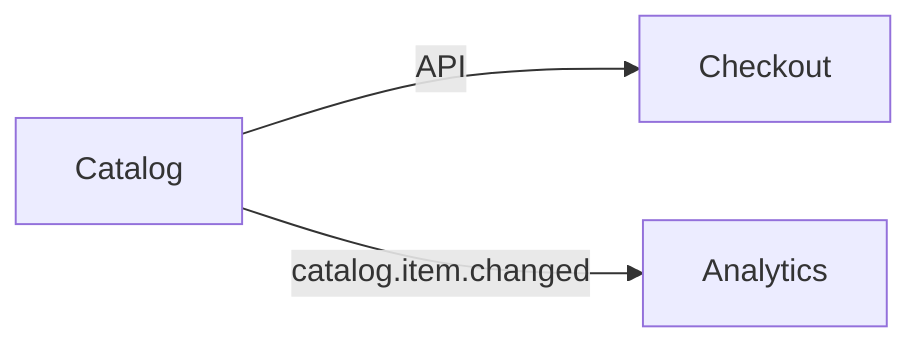

# Design Document: Synthetic catalog

## Overview
Implement CATALOG-ORG-001 through one explicit boundary adapter.

### Key Design Decisions
Reuse the shared schema; do not infer approval from a version label.

## Architecture


### Component Interaction Flow
Catalog serves Checkout through the API and emits versioned catalog.item.changed events to Analytics. Both representations use the pinned boundary definition.

## Components and Interfaces
### DESIGN-1
The local adapter preserves required catalog fields and rejects missing required fields.

## Data Models
item_id and price plus required currency; the authoritative definition specifies the derived event name, version, payload and semantics as part of the primary API boundary contract.

## Correctness Properties
For every accepted item, all fields required by the pinned definition survive the adapter; invalid input is rejected (CATALOG-ORG-001).

## Error Handling
Reject missing required fields and report the owner-check failure; no silent migration.

## Testing Strategy
Unit: required-field preservation and rejection. Integration: Catalog/Checkout/Analytics check at matching revisions. Smoke: local validators and wave resolver. Synthetic result attachments are illustrative, not actual execution claims.

## Organizational traceability
Initiative: catalog-expansion. Handoff: catalog-work.
Exact obligation RecordRef:
```json
{"digest": "sha256:b5d0405876bf898d76878c93867a7700b152018138f5aa3e157f0cb4b7180a03", "initiative_id": "catalog-expansion", "record_id": "catalog-api"}
```
Mapping: CATALOG-ORG-001 -> DESIGN-1 -> task 1. Disposition: implemented (allocated, not completed).
Current initiative/handoff digests are held separately to avoid content-hash cycles.
